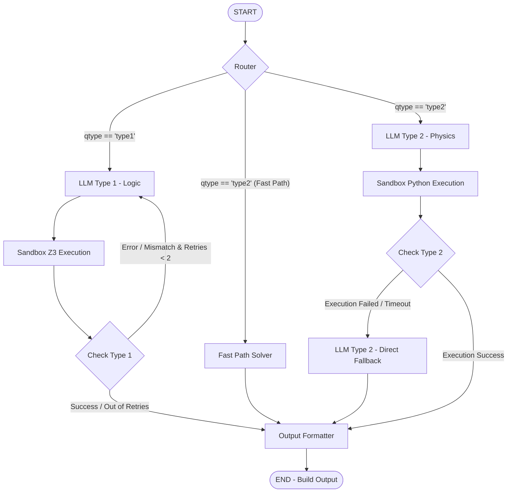

# EXACT 2026 — Neuro-Symbolic Agentic Framework

This repository hosts the Neuro-Symbolic Logic (Type 1) and Physics (Type 2) solving pipelines designed for the **EXACT 2026 (Option B)** competition. The architecture leverages **LangGraph** to coordinate a self-correcting reasoning pipeline, executing generated code inside a secure Python sandbox. It deploys both specialized PEFT adapters concurrently on a single vLLM instance to optimize resource utilization and comply with the strict **8B-class** parameter limit.

---

## 📌 Key Features

* **Zero-Latency Router:** Automatically routes incoming queries to the Logic or Physics pipeline based on query type metadata.
* **Dual-PEFT Adapter Architecture:**
  * **Base Model:** `Qwen/Qwen2.5-7B-Instruct` (7.61B parameters).
  * **Logic Adapter (Type 1):** LoRA fine-tuned for symbolic logic reasoning and Z3 Python script generation.
  * **Physics Adapter (Type 2):** LoRA fine-tuned for physics math reasoning and SymPy/Python script generation.
  * *Resource Efficiency:* Serves both adapters concurrently on a single shared vLLM engine, keeping total parameter residency at **7.95B** (under the 8B-class limit).
* **Secure Python Sandbox & Self-Correction:**
  * **Type 1 (Logic):** The Logic model generates an explanation, premises used, FOL formulas, and a Z3 Python script. The script runs in a secure sandbox. If Z3 output mismatches the direct LLM text prediction or hits execution errors, the system triggers a self-correction loop, feeding the error back to the LLM to regenerate the code (up to 2 retries within a 35-second budget).
  * **Type 2 (Physics):** The Physics model generates a standalone Python/SymPy script. If sandbox execution succeeds, the computed numerical value is selected as the answer. If a timeout or execution failure occurs, the pipeline falls back to the direct model prediction.
* **Rule-based Fast-Path Solver:** Resolves certain predefined physics queries instantly without invoking the LLM, reducing latency.
* **Post-processing Normalization:** Standardizes Greek units (e.g., `Ω` to `ohm`), coerces numeric outputs to 4 significant figures, and matches multiple-choice query options.

---

## 📐 LangGraph Workflow Architecture

The execution flow of the system is modeled as a stateful graph using LangGraph:



---

## 📂 Repository Structure

```bash
exact_2026/
├── configs/            # System configuration files
├── data/               # Evaluation datasets and raw/processed assets
│   ├── raw/            # Original raw competition datasets
│   ├── processed/      # Processed and augmented datasets
├── docs/               # Competition documents and solution descriptions
│   ├── EXACT 2026 - Submission Guide.pdf
│   ├── EXACT_Slides.pdf
│   ├── QA.pdf
│   ├── EXACT2026_Notation_Mapping_Template.csv
│   └── solution_description_v2.md  # Detailed solution description
├── models/             # Local checkpoint directory
├── notebooks/          # Jupyter notebooks for model training and evaluation
│   ├── type1/          # Notebooks for Logic SFT, GRPO RL, Data Prep, and Evaluation
│   └── type2/          # Notebooks for Physics SFT and GRPO RL
├── results/            # Run outputs and evaluation logs
└── src/                # Inference server source code
    ├── app/            # FastAPI core app and LangGraph pipeline definitions
    │   ├── pipelines/  # LangGraph nodes and edge logic
    │   ├── utils/      # Sandbox utility, JSON parser, and normalizers
    │   ├── main.py     # FastAPI endpoints (/predict, /v1/models)
    │   └── schemas.py  # Pydantic schemas for request/response validation
    ├── scripts/        # Deploy scripts, latency checkers, and vLLM metric patches
    ├── modal_exact2026.py   # Modal deployment configurations
    ├── requirements.txt     # Python packages for local environments
    └── Dockerfile      # Containerization instructions
```

---

## 🧮 Model Parameter Count Calculation

To satisfy the **8B-class parameter limit**, we run a shared vLLM engine that dynamically swaps active PEFT adapters on-the-fly without model reloading overhead:

* **Base LLM:** `Qwen/Qwen2.5-7B-Instruct` (~7.61B parameters).
* **PEFT Adapters:**
  * *LoRA 1 (Logic - Type 1):* $r=64, \alpha=128$, targeting all linear layers (~167M parameters).
  * *LoRA 2 (Physics - Type 2):* $r=64, \alpha=128$, targeting all linear layers (~167M parameters).
* **Inference Compliance:**
  * *Active Parameters (during forward pass):* $7.61\text{B (Base)} + 0.167\text{B (Active Adapter)} = \mathbf{7.78\text{B}}$ parameters.
  * *Total Loaded Parameters (both adapters in memory):* $7.61\text{B (Base)} + 0.167\text{B (LoRA 1)} + 0.167\text{B (LoRA 2)} = \mathbf{7.95\text{B}}$ parameters.
    *(Both configurations are strictly compliant with the 8.0B parameter threshold).*

---

## 🛠️ Setup & Deployment

### 1. Local Environment Setup

Requires Python 3.10+. Initialize a virtual environment and install packages:

```bash
# Navigate to the source folder
cd src

# Create and activate virtual environment
python3 -m venv .venv
source .venv/bin/activate  # On Windows: .venv\Scripts\activate

# Install dependencies
pip install -r requirements.txt
```

### 2. Local Testing (Mock Mode)

Test the FastAPI server structure and JSON schema formatting locally using dummy payloads without requiring GPU/vLLM servers:

```bash
MOCK_MODE=true pytest -q
```

### 3. Modal Deployment

The server is optimized for serverless GPU deployment on **Modal**:

```bash
# Install local Modal requirements
pip install -r requirements-modal-local.txt

# Authenticate Modal CLI
modal setup

# Create Hugging Face secret to download private adapters and base model
modal secret create huggingface-secret HF_TOKEN=hf_your_token_here

# Run preflight check to ensure LoRA adapters are accessible
python3 scripts/preflight_check_loras.py

# Deploy the application to Modal
modal deploy modal_exact2026.py

# Perform rollover to activate the latest app deployment
modal app rollover exact2026-optionb-qwen25
```

### 4. Verify Live Deployment

Obtain your Modal endpoint URLs and run live query latency validations:

```bash
export PREDICT_URL="https://<your-modal-workspace>--exact2026-optionb-qwen25-predict-api.modal.run/predict"
export VLLM_MODELS_URL="https://<your-modal-workspace>--exact2026-optionb-qwen25-vllm-server.modal.run/v1/models"

# Test API endpoints
bash scripts/modal_test_public.sh

# Run latency checks
python3 scripts/modal_latency_check.py
```

---

## 📝 Training Notebooks

For retraining the PEFT adapters, refer to the following resources in the `notebooks/` directory:

* `notebooks/type1/logic_train_sft.ipynb`: Supervised Fine-Tuning for Logic formatting.
* `notebooks/type1/logic_train_rl.ipynb`: **GRPO** (Group Relative Policy Optimization) RL alignment for Logic reasoning steps.
* `notebooks/type2/type2-physics-grpo-rl-uv-fast-with-validation.ipynb`: **GRPO** RL alignment for Physics calculations.

---

> [!NOTE]
> The patch in `scripts/fix_vllm_metrics.py` runs during the Docker image build on Modal to resolve route inspection bugs in vLLM/Prometheus. Do not modify or remove this script to avoid API failures when calling `/v1/models`.
