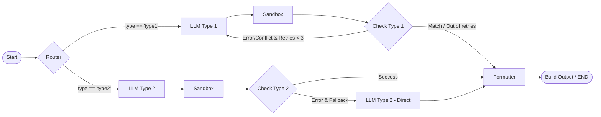

EXACT 2026 — Solution Description

1. Datasets Used

* **Type 1 (Logic):** Official EXACT 2026 Logic Dataset. 411 raw records augmented to 864 base records, split into **1,686 samples** (1,348 train / 168 val / 170 test). Executable `z3_code` fields generated via `mimo-v2.5-pro` and manuall audited.

  * *Sample:* `{"idx ":[[1] ,[7 ,10]] , "premises -FOL ":[" forall x (WT(x)->O(x))","..."] ,"premises ":["If a Python  code is well -tested , then  the  project  is  optimized ." ,"..."] ,"question ":[" Which  conclusion  follows ..." ,"..."] , "answer ":["A","Yes"],"explanation ":[" Premise 1 states  that ..." ,"..."] , "z3_code ":[" from z3  import  *..." ,"..."]}`
* **Type 2 (Physics):** Official EXACT 2026 Physics Dataset. 1,352 valid records (SFT: **1,348 samples**; GRPO RL: **946 samples**). Standalone `python_code` solver scripts generated via `mimo-v2.5-pro` and verified for sandbox execution compatibility.

  * *Sample:* `{" question ":" Calculate  the  energy  stored  in  capacitor C when C=100uF and U=30V.","python_code ":"C=100e-6\nU=30\nE=0.5*C*U**2\ nprint(E)","answer ":"45" , "unit ":"J", "explanation ":" Using E=1/2*C*U^2, C=1e-4 F, U=30V..."}`

2. Approach and Method

We implement a hybrid neuro-symbolic pipeline combining fine-tuned LLMs with deterministic verification tools using LangGraph:

* **Stage 1: Zero-Latency Routing:** A rule-based router directs queries to either the Logic or Physics pipeline based on the input `type` metadata.
* **Stage 2: Neuro-Symbolic Reasoning & Sandbox Verification:**
  * *Type 1 (Logic):* The fine-tuned Logic model (`Qwen + LoRA 1`) generates an explanation, premises used, FOL formulas, and a Z3 Python script. The script is run in a secure Python sandbox. If the Z3 execution result mismatches the direct LLM text output or encounters runtime errors, the system enters a self-correction loop, feeding the error back to the LLM to regenerate the solution (up to 2 retries under a 35s budget).
  * *Type 2 (Physics):* The Physics model (`Qwen + LoRA 2`) generates a standalone SymPy/Python script. If sandbox execution succeeds, the computed numerical value is selected as the answer. If a timeout or execution failure occurs, the pipeline falls back to the direct model prediction.
* **Model Training (SFT + GRPO RL):** Both LoRA adapters were aligned in a two-stage process: (1) **SFT (Supervised Fine-Tuning)** to establish formatting and syntax baselines; (2) **GRPO RL (Group Relative Policy Optimization)** using rule-based reward signals (compilation status, execution success, and final answer accuracy) to optimize the reasoning steps and code robustness.
* **Stage 3: Explanation & Formatting:**
  * For Physics, we implement a **dual-pass unified mode**: (1) `generate_code` computes the answer via the sandbox; (2) `explain_from_result` inputs the question and the computed result to generate a verified, hallucination-free explanation.
  * A post-processing step coerces numerical outputs to 4 significant figures, normalizes Greek units (e.g. converting `Ω` to `ohm`), and matches the exact options for MCQ queries.

3. Model Size and Parameter Calculation

To satisfy the **8B-class parameter limit**, we load two PEFT adapters concurrently over a single base LLM instance:

* **Base LLM:** `Qwen/Qwen2.5-7B-Instruct` (parameter count: **7.61B**).
* **PEFT Adapters:**
  * *LoRA 1 (Logic):* $r=64, \alpha=128$ targeting all linear layers (**167M** params).
  * *LoRA 2 (Physics):* $r=64, \alpha=128$ targeting all linear layers (**167M** params).
* **Inference Compliance:** The PEFT backend swaps active adapters dynamically via `.set_adapter()`.
  * *Active Parameters (inference forward pass):* $7.61\text{B (Base)} + 0.167\text{B (Active Adapter)} = \mathbf{7.78\text{B}}$ parameters.
  * *Total Loaded Parameters (both adapters in memory):* $7.61\text{B (Base)} + 0.167\text{B (LoRA 1)} + 0.167\text{B (LoRA 2)} = \mathbf{7.95\text{B}}$ parameters.
    Both configurations strictly remain within the **8B-class limit** at all times, ensuring absolute policy compliance.
